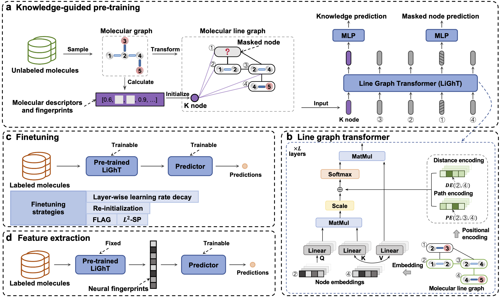

# KPGT
## About
This repository contains the code and resources of the following paper:

A Knowledge-Guided Pre-training Framework for Improving Molecular Representation Learning

## Overview of the framework
KPGT is a novel self-supervised learning framework for the representation learning of molecular graphs, consisting of a novel graph transformer architecture, LiGhT, and a knowledge-guided pre-training strategy.

 

## **Setup environment**

Setup the required environment using `environment.yml` with Anaconda. While in the project directory run:

    conda env create

Activate the environment

    conda activate KPGT

## **Download datasets**

We upload the datasets and splits used in our computational tests to figshare.

To download the datasets: https://figshare.com/s/8bbb8cad9ac644bf9caa.

Then unzip the file and put it in the KPGT/ directory.

## **Pre-train**

Download the pre-trained model at: https://figshare.com/s/d488f30c23946cf6898f.

Then unzip it and put it in the KPGT/models/ directory.

You also can follow the steps below to pre-train a new model.

### Step 1: Prepare dataset

Extract the molecular descriptors and fingerprints of the SMILES in the ChEMBL dataset:

    python preprocess_pretrain_dataset.py --data_path ../datasets/chembl29/

### Step 2: Pre-train

Use DistributedDataParallel to pre-train KPGT:

    CUDA_VISIBLE_DEVICES=0,1,2,3 python -u -m torch.distributed.run --nproc_per_node=4 --nnodes=1 --master_port 12312 train_kpgt.py --save_path ../models/pretrained/base/ --n_threads 8 --n_devices 4 --config base --n_steps 100000 --data_path ../datasets/chembl29/
    
You can configure the model by modifing the KPGT/src/model_config.py.
## **Finetune**

### Step 1: Prepare dataset

Construct molecular line graphs and extract the molecular descriptors and the fingerprints from SMILES in a downstream dataset (e.g., bace):

    python preprocess_downstream_dataset.py --data_path ../datasets/ --dataset bace 

### Step 2: Finetune

Fine-tune pre-trained model on a specific downstream task:

    For classification tasks:

    python finetune.py --config base --model_path ../models/pretrained/base/base.pth  --dataset bace --data_path ../datasets/ --dataset_type classification --metric rocauc --split scaffold-0 --weight_decay 0 --dropout 0 --lr 3e-5

    For regression tasks:

    python finetune.py --config base --model_path ../models/pretrained/base/base.pth  --dataset freesolv --data_path ../datasets/ --dataset_type regression --metric rmse --split scaffold-0 --weight_decay 0 --dropout 0 --lr 3e-5

Weight decay, dropout and lr are tunable hyper-parameters.

## **Evaluation**

Due to the non-deterministic function in PyTorch, it is hard to exactly reproduce the fine-tuning results. Therefore, we provide the fine-tuned model for eleven datasets under the transfer learning setting, to guarantee the reproducibility of the test results reported in our paper.

### Step 1: Download finetuned models

To download the fine-tuned models: https://figshare.com/s/fd55d94d6bb21b8d7c39

Then unzip it and put the files in the KPGT/models/downstream/ directory.

### Step 2: Reproduce the results

Then the results can be reproduced by:

    python evaluation.py --config base --model_path ../models/downstream/bace/scaffold_0.pth --dataset bace --data_path ../datasets/ --dataset_type classification --metric rocauc --split scaffold-0

The dataset, split and model can be specified using parameters --dataset, --split and --model_path, respectively. 

## **Generate latent features for arbitrary datasets**

To generate latent features for molecules from arbitrary datasets using the pre-trained KPGT:

    python extract_features.py --config base --model_path ../models/pretrained/base/base.pth --data_path ../datasets/ --dataset bace

Modify --dataset to specify the target dataset.

## Resources
Baseline methods: https://figshare.com/s/43e2dc41648f4d934c1a

Datasets: https://figshare.com/s/aee05cc329434b629c82

## License
KPGT is licensed under the Apache License, Version 2.0: http://www.apache.org/licenses/LICENSE-2.0.

